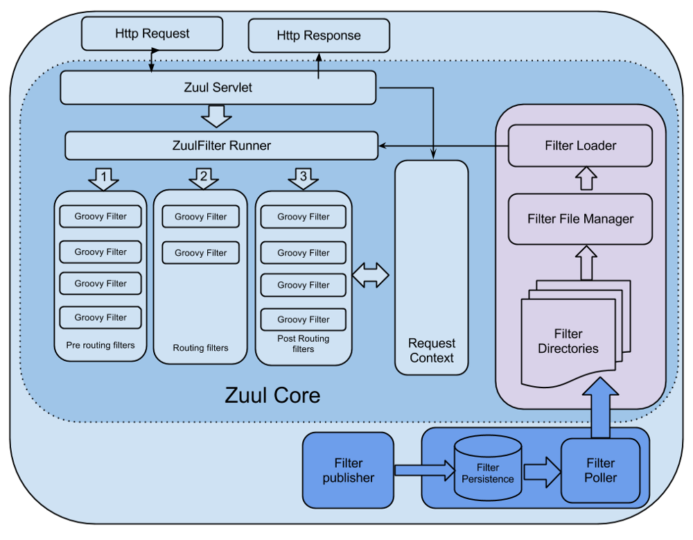
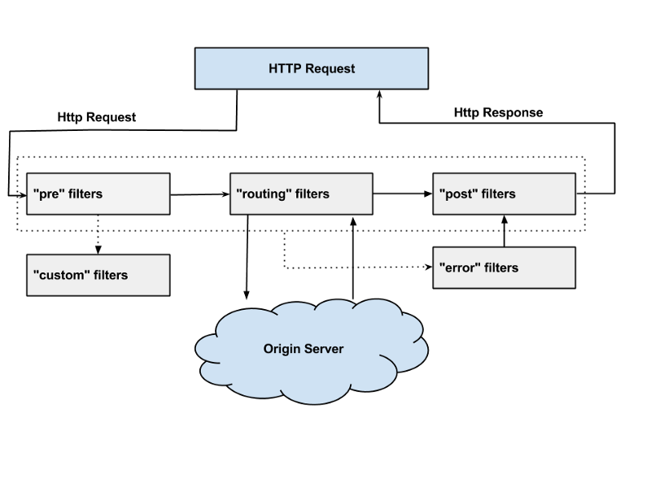

spring cloud zuul
=================
1.API GATEWAY란?  
-----------------
Microservice Architecture(이하 MSA)에서 언급되는 컴포넌트 중 하나이며, 모든 클라이언트 요청에 대한 end point를 통합하는 서버이다. 마치 프록시 서버처럼 동작한다. 그리고, 인증 및 권한, 모니터링, logging 등 추가적인 기능이 있다.  
모든 비지니스 로직이 하나의 서버에 존재하는 Monolithic Architecture와 달리 MSA는 도메인 별 데이터를 저장하고 도메일별로 하나 이상의 서버가 따로 존재한다. 한 서비스에 한개 이상의 서버가 존재하기 때문에 이 서비스를 사용하는 클라이언트 입장에서는 다수의 end-point가 생기게 되며, end-point를 변경이 있어났을떄, 관리하기가 힘들다. 그래서 MSA환경에서 서비스에 대한 도메인인 하나로 통합할 수 있는 API GATEWAY가 필요한 것이다.  

API GATEWAY를 도입하기 위한 오픈소스  
* KONG  
* API Umbrella  
* Netflix Zuul  
> Zuul is the front door for all requests from devices and web sites to the backend of 
the Netflix streaming application. As an edge service application, Zuul is built to enable 
dynamic routing, monitoring, resiliency and security. It also has the ability to route requests 
to multiple Amazon Auto Scaling Groups as appropriate.  

> Netflix에서 사용하는 API GATEWAY이다.  

2.Zuul이란?  
--------------------
2-1.Zuul을 사용하는 이유  
----------------------  
클라이언트 요청은 많은 트래픽과 다양한 형태(예상하지 못한)의 요청으로 경고없이 운영에 이슈를 발생시킨다. 이러한 상황에 신속히 대응할수 있는 시스템 zuul을 Netflix에서 개발하였다. zuul은 이러한 문제를 신속하고, 동적으로 해결하기 위해서 groovy 언어로 다양한 형태의 Filter를 실행한다. Filter에 기능을 정의하고, 이슈 사항 발생시 적절한 Filter를 추가함으로써 이슈사항을 대비할 수 있다.  

2-2.Netflix Filter의 기능 
----------------------- 
* Authentication and Security  
  * 클라이언트 요청시, 각 리소스에 대한 인증 요구 사항을 식별하고 이를 만족하지 않는 요청은 거부  
* Insights and Monitoring  
  * 의미있는 데이터 및 통계 제공  
* Dynamic Routing  
  * 필요에 따라 요청을 다른 클러스터로 동적 라우팅  
* Stress Testing
  * 성능 측정을 위해 점차적으로 클러스터 트래픽을 증가  
* Load Shedding  
  * 각 유형의 요청에 대한 용량을 할당하고, 초과하는 요청은 제한  
* Static Response handling  
  * 클러스터에 오는 응답을 대신하여 API GATEWAY에서 응답 처리  
  
</img>
> Zuul Core Architecture.png  

> 출처: https://netflixtechblog.com/announcing-zuul-edge-service-in-the-cloud-ab3af5be08ee  

위의 그림은 Zuul 시스템을 가장 잘 나타내주는 좋은 그림이라고 한다.  

* Filter File Manager에서는 일정 주기(정해진 시간)마다 정해진 directory에서 groovy로 정의된 Filter 파일을 가져온다  
* javax.servlet.http.HttpServlet을 상속받아서 ZuulServlet을 제정의 하였고, request 요청이 들어 올때마다 아래와 같이 preRoute(), route(), postRoute()에서 ZuulFilter Runner를 실행한다.  
* ZuulFilter Runner는 Filter에 정의된 기능을 실행한다.  
* 기본적으로 Filter은 다른 Filter들과 직접적으로 통신할 수 없다. 그래서 각각의 요청별로 RequestContext를 공유(마치 thread local같이)하여 통신 할 수 있다.  
  
```
@Override
public void service(javax.servlet.ServletRequest servletRequest, javax.servlet.ServletResponse servletResponse) throws ServletException, IOException {
    try {
        init((HttpServletRequest) servletRequest, (HttpServletResponse) servletResponse);

        // Marks this request as having passed through the "Zuul engine", as opposed to servlets
        // explicitly bound in web.xml, for which requests will not have the same data attached
        RequestContext context = RequestContext.getCurrentContext();
        context.setZuulEngineRan();

        try {
            preRoute();
        } catch (ZuulException e) {
            error(e);
            postRoute();
            return;
        }
        try {
            route();
        } catch (ZuulException e) {
            error(e);
            postRoute();
            return;
        }
        try {
            postRoute();
        } catch (ZuulException e) {
            error(e);
            return;
        }

    } catch (Throwable e) {
        error(new ZuulException(e, 500, "UNHANDLED_EXCEPTION_" + e.getClass().getName()));
    } finally {
        RequestContext.getCurrentContext().unset();
    }
}
```  

2-3.Zuul Filter  
----------------  
Zuul Filter는 크게 4가지 Filter로 나누어진다.  
* Pre Filter - 라우팅 전에 실행되는 필터이다. 주로 loggin, 인증등이 pre fileter에서 이루어 진다.  
* Routing Filter -  요청에 대한 라우팅을 다루는 필터이다. Apache httpclient를 사용하여 정해진 URL로 보낼수 있고, Neflix Ribbon을 사용하여 동적으로 라우팅 할 수도 있다.  
* Post Filter - 라우팅 후에 실행되는 필터이다. response에 HTTP Header를 추가하거나, response에 대한 응답속도, Status Code, 등 응답에 대한 statistics and metrics을 수집한다.  
* Error Filter - 에러 발생시 실행되는 필터이다.  

</img>  

> Request-Lifecycle.png  

> 출처: https://medium.com/netflix-techblog/announcing-zuul-edge-service-in-the-cloud-ab3af5be08ee  

위와 같이 요청이 들어면 Pre Filter를 실행하고,  
 Routing Filter에 의해 원하는 서버로 요청을 보낸다.  
  원하는 서버에서 응답이 오면 Post Filter를 실행시킨다.


2-4. Zuul Components  
---------------------
Zuul은 4개의 컴포넌트로 구성한다.  
* zuul-core : 위에서 설명한 zuul의 Request LifeCycle을 담당하고, Filter를 컴파일하고 실행하는 기능을 담당하고 있는 zuul의 Core Library  
* zuul-netflix : 기본적인 zuul에 NetflixOSS Library를 추가한다.  
* zuul-simple-webapp : zuul-core만 사용한 아주 기본적인 web application  
* zuul-netflix-webapp : zuul-core와 함께 zuul-netflix를 사용한 web application  

API GATEWAY를 구축하기 위해서 zuul-simple-webapp을 사용한다는 것은 MSA환경에서 아주 유용한 NetflixOSS library를 포기하는 것이다. zuul-netflix-webapp을 도입하기에는 학습곡선이 크다. 그래서 필요한것이 spring cloud netflix 프로젝트 이다.  

3.Spring Cloud Netflix  
----------------------
Spring boot에 NetflixOSS를 통합적으로 제공한다. annotation과 yml설정만으로도 아주 쉽게 NetflixOSS를 사용할 수 있다.  

 


참고 링크  
----------
----------
LINK : [spring-cloud-netflix.docs](https://spring.io/projects/spring-cloud-netflix)  
LINK : [배민-API-GATEWAY-적용사례](http://woowabros.github.io/r&d/2017/06/13/apigateway.html)  
LINK : [Zuul2-참고-gitbook](https://coe.gitbook.io/guide/gateway/zuul_2)     
LINK : [실습참고1](https://coding-start.tistory.com/123)  
LINK : [실습참고2](https://jsonobject.tistory.com/464)  
LINK : [실습참고3](https://eblo.tistory.com/69)  
LINK : [실습참고4](https://sarc.io/index.php/cloud/1747-zuul)  
LINK : [Gradle 정리](https://netframework.tistory.com/entry/Gradle-%EC%A0%95%EB%A6%AC-single-project)  
LINK : [실습참고5](https://www.baeldung.com/spring-rest-with-zuul-proxy)  
LINK : [실습참고6](https://www.baeldung.com/zuul-load-balancing)  
LINK : [실습참고7](https://lion-king.tistory.com/13)  
LINK : [실습참고8](https://ssipflow.github.io/msa/Spring-Cloud-API-Gateway-01/)  
LINK : [참고9](https://coe.gitbook.io/guide/service-discovery/eureka)  


